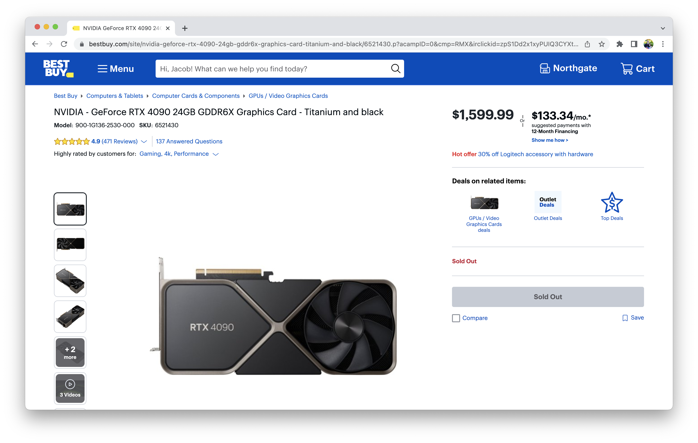

# RTX 4090 Founder's Edition Stock Tracker

A simple CLI tool which will continuously check if the [RTX 4090 Founder's Edition](https://www.nvidia.com/en-us/geforce/graphics-cards/40-series/rtx-4090/) is in stock on [ww.bestbuy.com](https://www.bestbuy.com/site/nvidia-geforce-rtx-4090-24gb-gddr6x-graphics-card-titanium-and-black). It will text you as soon as the RTX 4090 is available for purchase.



## Installation

1. Download the project: `git clone git@github.com:Jacobinski/RTX-4090-Stock-Tracker.git`
2. Download and install [Python 3.10.0](https://www.python.org/downloads/release/python-3100/)
3. Install required modules: `pip install -r requirements.txt`
4. Setup a free Twilio account: https://www.twilio.com/try-twilio
5. Configure notifications by creating a `config.yaml` file in the same directory as `main.py` and populating it with your Twilio information:
    ```yaml
    twilio:
    account_sid: 'ACXXXXXXXXXXXXXXXXXXXXXXXXXXXXXXXX'
    auth_token: '31XXXXXXXXXXXXXXXXXXXXXXXXXXXXXX'
    message_sender: '+1888XXXXXXX'
    message_receiver: '+1XXXXXXXXXX'
    ```
6. Run the tool and wait a few days for BestBuy to restock the RTX 4090: `python main.py`